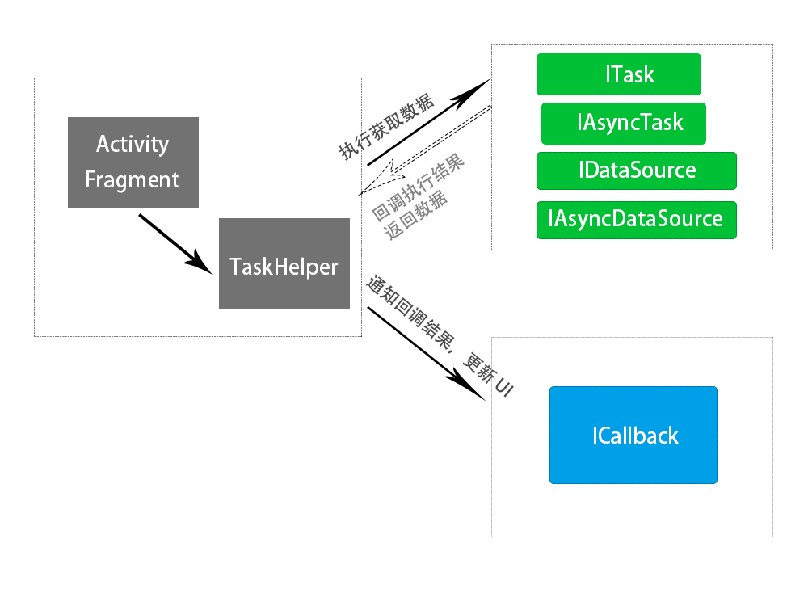
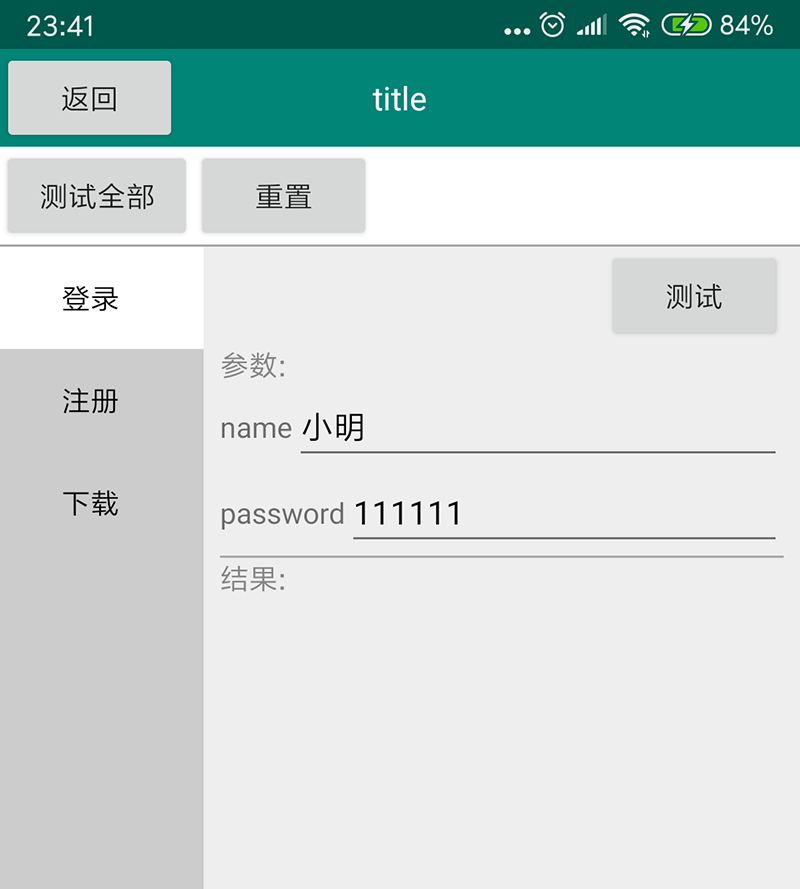

# Task #

该类库的用途：

**【1】抽象性，面向接口编程，实现Task接口即可，所有执行过程都可以描述为一个task**

**【2】可组合，复杂的Task（复杂多个多个步骤的执行过程）可以由多个简单task组合成一个task**

例如：注册流程：

用户点击注册将头像，名字性别提交服务器：1.压缩头像，2上传头像到存储服务器返回头像url，3.将头像url和名字性别等信息提交服务器

可以分解成：压缩图片Task，上传图片Task，提交服务器数据Task

注册Task由 压缩图片Task，上传图片Task，提交服务器数据Task组合而成一个复杂Task，外面调用只关心注册Task。

**【3】单一原则，一个Task实现单独一种业务**

**【4】单元测试,  提供了TestCase界面方便直接测试**

该类库由之前自己的类库开始，后借鉴于RxJava的操作发和写法进行完善

与RxJava比较不同点

| RxJava      | Task |
| ------------- |:-------------:|
|Observable是类| Task是接口  |
|Observable是源源不断的相同类型流数据传递| task 有单独的进度通知和结束，实现进度比较容易 |
|通过Observable操作符进行组合，操作符逻辑都在Observable| 有单独提供Tasks类对个Task组合，Task只是接口 |
|Observable是流事件上个Observable会继续影响下个Observable| Task执行完成才会继续执行下个Task |
|Observable既可以是后期使用的时候指定线程| ITask和IAsyncTask直接区主线程执行还是后台执行，不用在使用的时候设置线程，当然使用的时候也提供了设置线程的方法 |

Download sample [Apk](https://github.com/LuckyJayce/MVCHelper/blob/master/raw/MVCHelper_Demo.apk?raw=true)  

### 历史版本和更新信息  

https://github.com/LuckyJayce/Task/releases

# Gradle导入

## 1.必须导入：

```
//TAsk核心类库
compile 'com.shizhefei:MVCHelper-Task-Core:1.4.0'
```

## 2.可选：

**【1】  Tasks ：Task操作符类库**
​    比如：

```
IAsyncTask<User> task = Tasks
        .create(new InitTokenTask())
        .concatWith(new GetUserTask()));
```

引入方式：

    //Task操作符类库
    compile 'com.shizhefei:MVCHelper-Tasks:1.4.0'

**【2】  TestCase ：Task测试用例类库**
​     用于直接单独测试写好的task，提供简化的界面执行操作

```
//Task测试用例类库
compile 'com.shizhefei:MVCHelper-TestCase:1.4.0'
```

**【3】   mvchelper_okhttp：简化请求方便使用**

例如：

```
GetMethod method = new GetMethod("http://www.baidu.com");
method.addParam("name", "xx");
method.addParam("age", 1);
method.addHeader("sign", "HJKHUIGUI323H");
method.executeAsync(sender, new ResponseParser<User>() {
    @Override
    public User parse(Response response) throws Exception {
        if (response.isSuccessful()) {
            return new User();
        }
        throw new NetworkException(response);
    }
});
```

引入方式：

```
//Task的okhttp简化类库
compile 'com.shizhefei:MVCHelper-OkHttp:1.4.0'
```

## 结构

  

#### 【1】 ITask ：后台Task，不需要自己开线程，execute的方法在后台执行可以执行超时任务

```
public interface ITask<DATA> extends ISuperTask<DATA> {

    /**
     * 后台线程执行
     * @param progressSender 发送进度数据
     * @return 返回结果数据
     * @throws Exception 失败的时候通过异常抛出
     */
    DATA execute(ProgressSender progressSender) throws Exception;

    /**
     * 外面通过这个执行取消
     */
    void cancel();
}
```

例子：

```
public class DownloadSyncTask implements ITask<String> {
    private String url;
    private String filePath;
    private volatile boolean cancel;

    public DownloadSyncTask(String url, String filePath) {
        this.url = url;
        this.filePath = filePath;
    }

    @Override
    public String execute(ProgressSender progressSender) throws Exception {
      //这个函数是在后台线程调用执行，可以执行超时的任务
        int total = 500;
        for (int i = 0; i < total && !cancel; i++) {
            Thread.sleep(10);
            progressSender.sendProgress(i, total, “progress info”);
        }
    	//错误的情况通过自定义异常抛出， ICallback会接收到
    	//throw new NetWorkException("网络出错");
        return filePath;
    }

    @Override
    public void cancel() {
        cancel = true;
    }
}
```

#### 【2】IAsyncTask 异步Task，需要自己开线程异步操作，execute的方法在主线程执行，不能执行超时任务

```
public interface IAsyncTask<DATA> extends ISuperTask<DATA> {

    /**
     * 主线程执行
     * @param sender 发送进度或者结果数据，回调ICallback的onProgress或者onPost
     * @return 返回给外面一个取消句柄，外面通过这个执行取消
     * @throws Exception
     */
    RequestHandle execute(ResponseSender<DATA> sender) throws Exception;

}
```

例如OkHttp异步请求：

```
public class GetDetail implements IAsyncTask<Book> {
    @Override
    public RequestHandle execute(final ResponseSender<Book> sender) throws Exception {
        Request request = new 	 Request.Builder().url("https://www.baidu.com").get().build();
        Call call = OkHttpUtils.client.newCall(request);
        call.enqueue(new Callback() {

            @Override
            public void onFailure(Call call, IOException e) {
                //send 发送失败信息
                sender.sendError(e);
            }

            @Override
            public void onResponse(Call call, Response response) throws IOException {
                //发送成功信息
                sender.sendData(new Book("Java编程思想"));
            }
        });
        return new OKHttpRequestHandle(call);
    }
}
```

#### 【3】IDataSource ， IAsyncDataSource 和ITask ， IAsyncTask 类似，用于列表请求

​           使用详情参考：https://github.com/LuckyJayce/MVCHelper 项目

**【4】ICallback : 执行Task的回调**

```
/**
 * task回调
 * Created by LuckyJayce on 2016/7/17.
 */
public interface ICallback<DATA> {

    /**
     * 执行task之前的回调， 主线程
     */
   void onPreExecute(Object task);

    /**
     * 进度更新回调
     *
     * @param percent
     * @param current
     * @param total
     * @param extraData
     */
   void onProgress(Object task, int percent, long current, long total, Object extraData);

    /**
     * 执行完成的回调
     *
     * @param task      执行的task
     * @param code      判断：失败，异常，取消
     * @param exception 返回异常的时候数据
     * @param data 返回成功的数据
     */
   void onPostExecute(Object task, Code code, Exception exception, DATA data);
}
```

**【5】TaskHelper：执行task和设置Callback回调**

TaskHelper是连接task和Callback桥梁，执行task，task通过TaskHelper通知Callback数据和更新UI.

taskHelper可以同时执行多个task

例如：

```
//执行获取书本数据task
taskHelper.execute(new GetBookTask("Java编程思想"), new GetBookCallback()); 

//执行登录task, taskHandle可以对LoginTask进行单独取消
TaskHandle taskHandle = taskHelper.execute(new LoginTask(), new LoginCallback()); 

//根据task实例取消task
taskHelper.cancel(loginTask);

taskHelper.cancelAll();取消所有task
taskHelper.destroy();取消所有task，目前和cancelAll相同逻辑

//注册所有通过当前taskHelper执行task回调的callback事件
taskHelper.registerCallBack(new AllCallback());
//注销事件
taskHelper.unRegisterCallBack(allcallback);

```


## 操作符

**【1】async 将ITask 转化为 IAsyncTask**

```
IAsyncTask<User> task = Tasks.async(new LoginSyncTask());
```

**【2】just 将一个数据构建为一个task**

```
IAsyncTask<User> task = Tasks.just(new User());
```

**【3】map 转化数据类型**

```
//将string型的111转化为数字111
LinkTask<Integer> test = Tasks.just("111").map(new Func1<String, Integer>() {
    @Override
    public Integer call(String data) throws Exception {
        return Integer.parseInt(data);
    }
});
```

**【4】defer 延迟创建task，执行时候才会创建实际task**

主要用途，创建实际的task比较占用资源，等到执行的时候才去创建

```
LinkTask<User> task = Tasks.defer(new Func0<IAsyncTask<User>>() {
    @Override
    public IAsyncTask<User> call() throws Exception {
        return new LoginAsyncTask("小明", "111111");
    }
});
```

**【5】delay 延时执行**

```
//延时10秒执行
IAsyncTask<HomeData> task = ITaskTasks.create(new GetHomeDataTask()).delay(10 * 1000)
```

**【6】timeout 超时**

```
//超时30秒任务直接失败，Callback接收到TimeoutException不再接收task返回的数据，task会被调用cancel执行取消逻辑
IAsyncTask<HomeData> task = Tasks.create(new GetHomeDataTask()).timeout(30 * 1000);
```

**【7】retry 重试**，task执行过程出现异常，时调用

```
//失败重试3次
IAsyncTask<HomeConfigData> task = Tasks.create(new GetHomeConfigDataTask()).retry(3);
```

判断失败原因执行新的task

```
IAsyncTask<HomeData> task = Tasks.create(new GetHomeDataTask()).retry(new Func2<IAsyncTask<HomeData>, Exception, IAsyncTask<HomeData>>() {
    @Override
    public IAsyncTask<HomeData> call(IAsyncTask<HomeData> homeDataIAsyncTask, Exception e) throws Exception {
        //判断失败原因执行新的task
        return null;
    }
});
```

**【8】concatWith 顺序执行下一个task**

```
//获取首页配置继续获取首页ad
LinkTask<HomeAdData> task = Tasks.create(new GetHomeConfigDataTask()).concatWith(new GetHomeAdDataTask());
```

**【9】concatMap 顺序执行下一个task, 这里可以得到上一个task的结果值**

```
//通过获取配置信息，通过配置信息获取首页广告
LinkTask<HomeAdData> task = Tasks.create(new GetHomeConfigDataTask()).concatMap(new Func1<HomeConfigData, IAsyncTask<HomeAdData>>() {
    @Override
    public IAsyncTask<HomeAdData> call(HomeConfigData data) throws Exception {
        return new GetHomeAdDataTask(data);
    }
});
```

**【10】combine 并发执行task，当所有的task执行完成返回所有的结果值**

```
LinkTask<HomeData> task = Tasks.combine(new GetHomeAdDataTask(), new GetHomeSaleTask(), new Func2<HomeAdData, HomeSaleData, HomeData>() {
    @Override
    public HomeData call(HomeAdData homeAdData, HomeSaleData homeSaleData) throws Exception {
        return new HomeData(homeAdData, homeSaleData);
    }
});
```

**【11】组合的一个例子：**

1.延迟10秒获取首页配置

2.通过首页配置，获取首页广告数据，获取首页销售数据

3.将销售数据和广告数据合成一个首页完整数据

4.如果整个task执行过程中失败重试3次

5.如果整个task执行超过30秒，则抛出超时异常不再执行

```
public class GetHomeDataTask extends ProxyTask<HomeData> {

    @Override
    protected IAsyncTask<HomeData> getTask() {
        return Tasks.create(new GetHomeConfigDataTask()).delay(10 * 1000)//延迟10秒获取首页配置
                .concatMap(new Func1<HomeConfigData, IAsyncTask<HomeData>>() {//通过首页配置，获取首页广告数据，获取首页销售数据
                    @Override
                    public IAsyncTask<HomeData> call(HomeConfigData data) throws Exception {
                        return Tasks.combine(new GetHomeAdDataTask(), new GetHomeSaleTask(), new Func2<HomeAdData, HomeSaleData, HomeData>() {
                            @Override
                            public HomeData call(HomeAdData homeAdData, HomeSaleData homeSaleData) throws Exception {
                            //将销售数据和广告数据合成一个首页完整数据
                                return new HomeData(homeAdData, homeSaleData);
                            }
                        });
                    }
                }).retry(3)//如果整个task执行过程中失败重试3次
                .timeout(30 * 1000);//.如果整个task执行超过30秒，则抛出超时异常不再执行
    }
}
```


## 测试用例

```
public static class TestCaseFrFragment extends ABSTestCaseFragment {

    @Override
    protected List<TestCaseData> getTestCaseDatas() {
        List<TestCaseData> data = new ArrayList<>();
        data.add(new TestCaseData("登录", new LoginSyncTask("小明", "111111")));
        data.add(new TestCaseData("注册", new RegisterTask("小明", 10, "111111", Environment.getExternalStorageDirectory() + File.separator + "a.png")));
        data.add(new TestCaseData("下载", new DownloadSyncTask("url", "path")));
        return data;
    }
}
```

以上代码生成的界面如下图：

